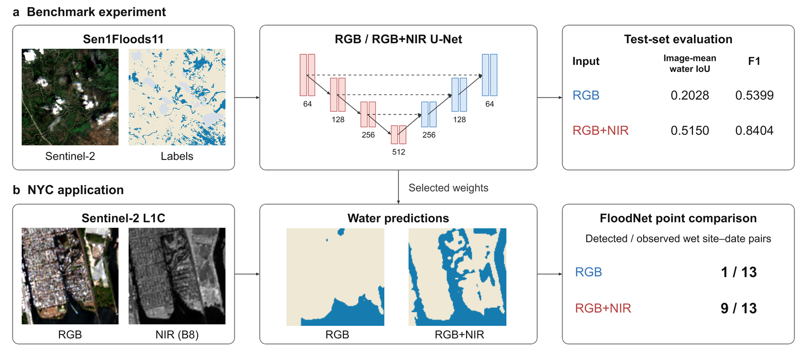
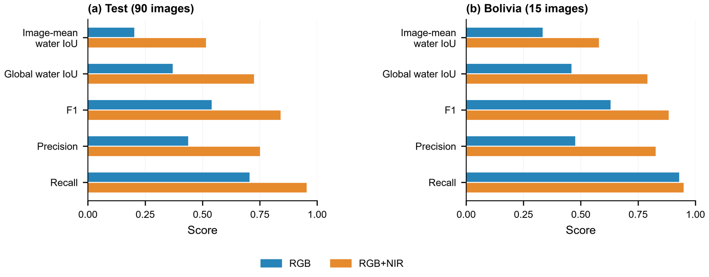
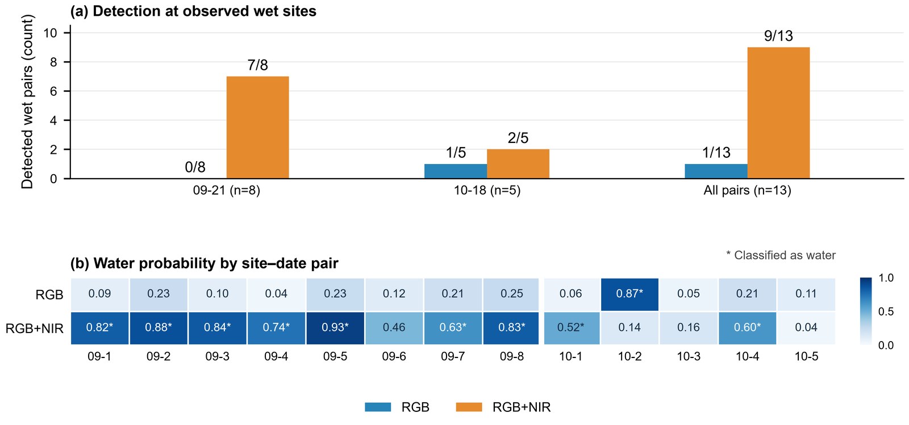

# Satellite Water Segmentation · NYC Case Study

**RGB versus RGB+NIR U-Net on Sen1Floods11, followed by application to New York City Sentinel-2 imagery and comparison with FloodNet ground observations.**

[English report](docs/00_project_summary_en.html) · [中文报告](docs/00_project_summary.html) · [Reproduction guide](docs/reproduction.md) · [Result CSVs](results/)

Download or clone the repository and open either HTML report in a browser. Keep its `docs/assets/` image folder alongside it.

## Experiment

The final experiment adapts the public WorldFloods U-Net architecture to RGB (B4/B3/B2) and RGB+NIR (adding B8). Both use the official Sen1Floods11 splits, training-derived channel standardization and the same 25-epoch protocol. The objective is 0.5 weighted cross-entropy + 0.5 Dice; validation Dice selects weights.

| Held-out split | Input | Image-mean water IoU | Global water IoU | F1 |
|---|---|---:|---:|---:|
| Test (90 images) | RGB | 0.2028 | 0.3698 | 0.5399 |
| Test (90 images) | RGB+NIR | 0.5150 | 0.7247 | 0.8404 |
| Bolivia (15 images) | RGB | 0.3337 | 0.4594 | 0.6296 |
| Bolivia (15 images) | RGB+NIR | 0.5793 | 0.7908 | 0.8832 |

Image-mean water IoU averages water-class IoU across images; global water IoU pools valid pixels first. These are single-seed results (seed 12), not a multi-run estimate.

## NYC application

The fixed models were applied to 13 site–date windows at 10 FloodNet sites on 21 September and 18 October 2024. L1C reflectance and training normalization were matched to the model inputs; the satellite overpass was aligned with bracketing depth observations.

RGB classified **1/13** observed wet sensor pixels as water; RGB+NIR classified **9/13**. This describes model behavior at observed wet points. It does not estimate citywide segmentation accuracy or newly flooded area: the masks also include permanent water.

## Start here

| Notebook | Role |
|---|---|
| [01 · Data preview](notebooks/01_data_preview.ipynb) | Inspect imagery, labels and official splits |
| [08 · Final U-Net experiment](notebooks/08_train_public_unet_rgb_vs_rgb_nir.ipynb) | Train and evaluate RGB and RGB+NIR |
| [09 · Error analysis](notebooks/09_results_and_error_analysis.ipynb) | Examine held-out predictions and errors |
| [11 · NYC inference](notebooks/11_nyc_l1c_inference.ipynb) | Apply trained models to matched L1C inputs |
| [12 · Ground comparison](notebooks/12_nyc_floodnet_point_validation.ipynb) | Match predictions to FloodNet observations |

Notebook 08 is self-contained. Earlier diagnostics are retained as concise experiment history, not required stages. Notebook outputs are cleared in Git; completed evidence is in the HTML reports, source figures and small result CSVs. See the [reproduction guide](docs/reproduction.md) for setup, downloads and checkpoint requirements.

## Repository contents

- `notebooks/`: English experiments and bilingual Summary sources.
- `scripts/`, `configs/`: data preparation, plotting and export code.
- `results/`: benchmark metrics and all 13 matched observations.
- `docs/`: lightweight bilingual reports, shared images and reproduction notes.
- `figure_sources/`: original recorded panels and diagram thumbnails; editable PPT in `docs/figures/`.

Satellite data, trained weights, local environments, downloaded papers and temporary outputs are excluded. The historical final-08 checkpoint and numeric epoch logs are not distributed; retraining creates a new run. Training curves in the report preserve the original record.

## Sources

[Sen1Floods11](https://github.com/cloudtostreet/Sen1Floods11) · [WorldFloods](https://doi.org/10.1038/s41598-021-86650-z) · [FloodNet](https://www.floodnet.nyc/methodology) · [NYC street-flood events](https://data.cityofnewyork.us/d/aq7i-eu5q)

Full method and figure attribution is provided in the report and reproduction guide.
